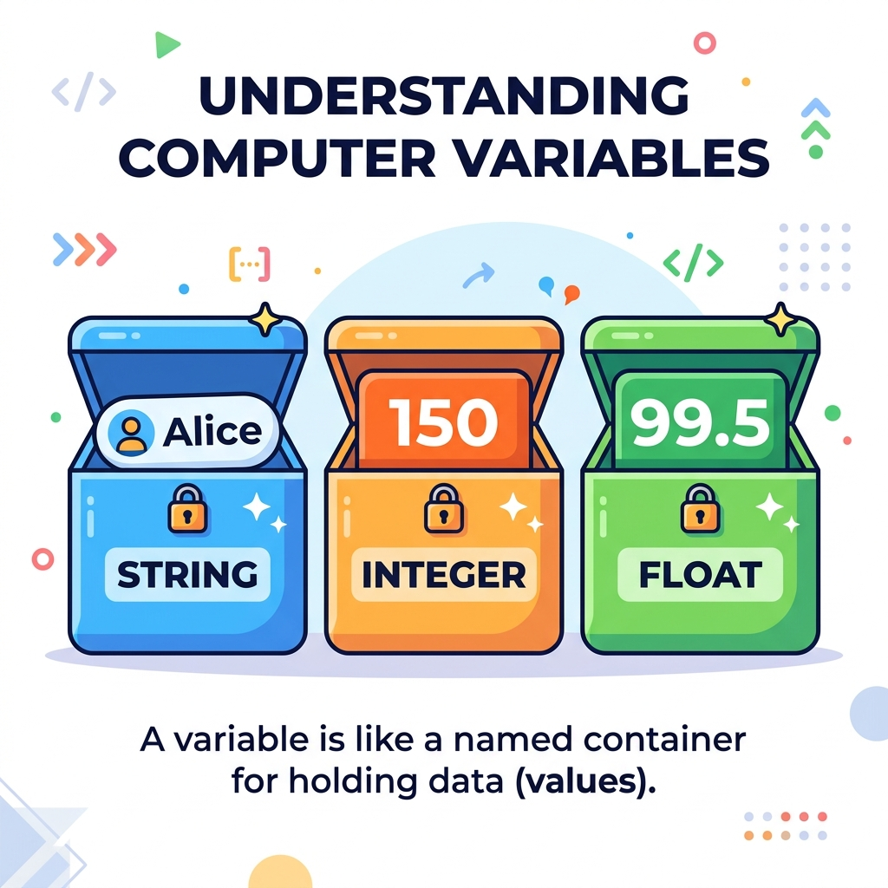

# Session 1: Basics of Python

## Objective & Real-World Application
Welcome to **Application Based Programming in Python**! In this course, we won't just be memorizing theory—we will be building practical, real-world projects. Every app you use daily, from Instagram to your banking app, started with the basics you're about to learn. 

By the end of this module, you will have built web apps, scraped live data from the internet, and even trained a machine learning model to predict prices.

---

## 1. What is Python?
**Python** is a high-level, interpreted programming language known for its simplicity and readability. 
Imagine Python as a universal translator between you and the computer. Instead of speaking in complex 1s and 0s, Python allows you to speak in plain English. It focuses on *what* you want to do rather than the complex syntax of *how* to do it.

**Why Python?**
- **Beginner-Friendly:** Its syntax is clean. You don't need semicolons or messy brackets.
- **Versatile:** Used heavily in Web Development (Django, Flask), Data Science (Pandas), AI/Machine Learning, and Automation.
- **Real-World Example:** Netflix uses Python for its recommendation engine, and Spotify uses it for data analysis!

---

## 2. Variables and Assigning Values

Think of a **variable** as a labeled storage box. 



When you play a video game, the game needs to remember your score, your health, and your username. It stores this information in "boxes" (variables) so it can update them as you play.

```python
# Assigning values to variables
player_name = "Alice"  # Storing text (String) - Like writing a name on a label
score = 150            # Storing a whole number (Integer)
health = 99.5          # Storing a decimal (Float) - Like health percentages

# To peek inside the box and show it on the screen, we use print()
print("Player:", player_name)
print("Score:", score)
```

---

## 3. Keywords, Identifiers, and Naming Rules

### Identifiers (Naming your boxes)
An **identifier** is simply the name you give to your variable box. 

**Rules for Naming Identifiers:**
1. Can only contain letters (a-z, A-Z), numbers (0-9), and underscores (`_`).
2. **Cannot start with a number.** (`1name` is invalid, `name1` is valid).
3. **Case-Sensitive:** `Age`, `age`, and `AGE` are three completely different boxes!

> **Real-World Tip:** Always use descriptive names. `user_email` is much better than `x`. Imagine moving to a new house and labeling all your boxes `Box 1`, `Box 2` instead of `Kitchen`, `Bedroom`.

### Keywords (Reserved Words)
Keywords are words Python has reserved for itself. You cannot use them as variable names.
*Examples:* `True`, `False`, `if`, `else`, `for`, `while`.

---

## 4. Statements, Comments, and Indentation

### Statements
A statement is an instruction that the Python interpreter executes.
```python
print("Hello, World!") # This is a print statement
```

### Comments (Notes to Yourself)
Comments are notes written in the code for humans. The computer ignores them.
**Real-World Example:** Think of comments like sticky notes left on a recipe telling the next chef *why* you added extra salt.

```python
# This is a single-line comment
print("Welcome to Python!") 

"""
This is a multi-line comment.
We use it to write longer explanations.
"""
```

### Indentation: Python's Superpower
Python uses **indentation** (spaces at the beginning of a line) to group code together. Most other languages use `{}`. Indentation forces Python code to be neat and readable.

```python
if True:
    print("This line is indented!") # Python knows this belongs to the 'if' block
```

---

## 📺 Further Reading & Video Suggestions
- **"Python Tutorial for Beginners - Full Course"** by Programming with Mosh
- **"Python Variables and Data Types"** by Corey Schafer
