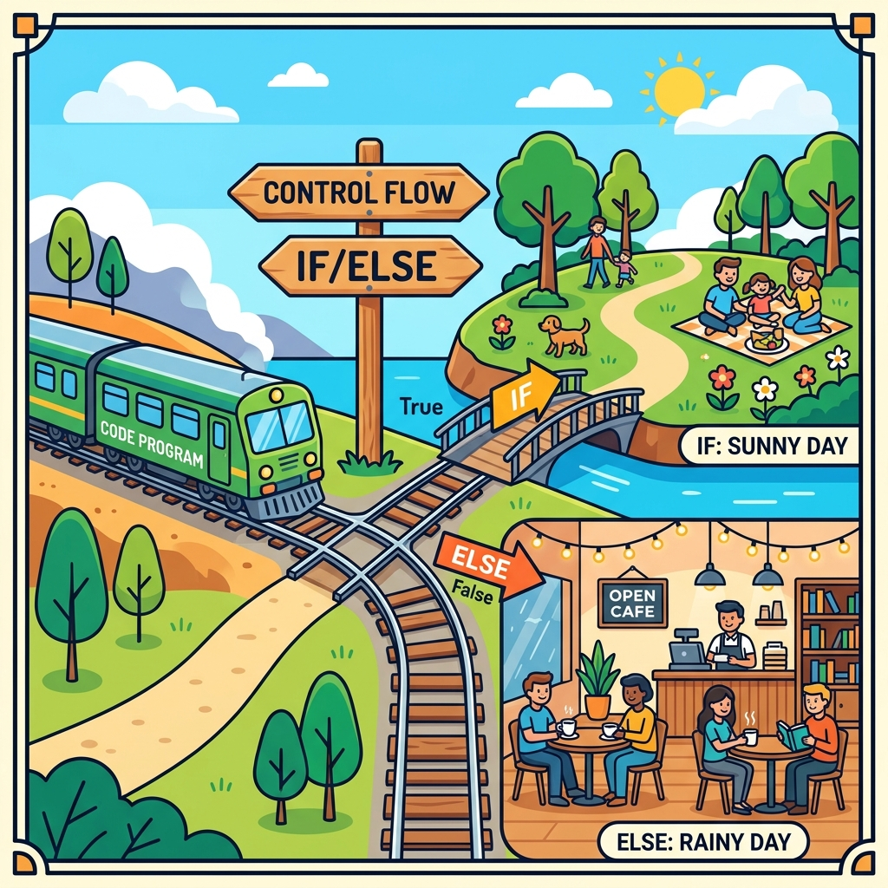

# Session 2: Programming Language Construct

## Objective & Real-World Application
In Session 1, we learned how to store basic data in variables. Today, we're going to dive deeper into **Data Types**, manipulate data using **Operators** (like a calculator), and give our program a brain to make decisions using **Control Flow**. 

**Real-World Example:** When you log into an app, the app checks: *If* the password is correct, let them in; *Else*, show an error. That is Control Flow!

---

## 1. Data Types in Python
Every value in Python has a specific "type", which tells Python what operations are allowed. You can't multiply a word by a word, but you can multiply numbers!

### Core Data Types:
1. **Numeric Types:**
   - **Integer (`int`):** Whole numbers. Example: Tracking the number of lives in a game (`3`).
   - **Float (`float`):** Decimal numbers. Example: Tracking a bank account balance (`105.50`).
2. **Text Type (`str`):** Strings of characters enclosed in quotes. Example: A user's tweet (`"Hello world!"`).
3. **Boolean Type (`bool`):** Represents `True` or `False`. Example: Is the user logged in? (`True`).

---

## 2. Python Operators
Operators are special symbols used to carry out calculations or logical operations.

### Arithmetic Operators (Math)
- `+` (Addition): `5 + 3` ➔ `8`
- `-` (Subtraction): `5 - 3` ➔ `2`
- `*` (Multiplication): `5 * 3` ➔ `15`
- `/` (Division): `10 / 2` ➔ `5.0`
- `%` (Modulus/Remainder): `10 % 3` ➔ `1` (Used often to check if a number is even or odd!)

### Comparison Operators (Asking Questions)
These compare two values and always result in a Boolean (`True` or `False`).
- `==` (Equal to): Is `5 == 5`? ➔ `True`
- `!=` (Not equal): Is `5 != 3`? ➔ `True`
- `>` (Greater than), `<` (Less than)

### Logical Operators (Combining Questions)
- `and`: `True` if BOTH are true. (e.g., username is correct AND password is correct).
- `or`: `True` if ONE is true. (e.g., login with email OR phone number).

---

## 3. Control Flow Statements

Programs usually run from top to bottom. Control flow allows us to branch off into different paths or repeat code.



### Conditional Statements (`if`, `elif`, `else`)
Think of this like reaching a fork in the train tracks. The train reads the sign (condition) and decides which track to take.

```python
weather = "rainy"

if weather == "sunny":
    # If the condition above is True, the code comes here
    print("Let's go to the park!")
elif weather == "rainy":
    # If the first was False, but this is True, it comes here
    print("Take an umbrella!")
else:
    # If absolutely nothing above was True, it defaults to here
    print("Stay inside just in case.")
```

### Looping Statements (`for` and `while`)
Loops allow you to execute a block of code multiple times without rewriting it.

**The `for` loop:** Used when you know *exactly* how many times you want to iterate.
*Real-World Example:* Sending a promotional email to all 100 users on a mailing list.
```python
# Iterates 5 times (0, 1, 2, 3, 4)
for i in range(5):
    print("Iteration number:", i)
```

**The `while` loop:** Used when you want to repeat code *as long as* a condition remains `True`.
*Real-World Example:* Keeping a game running while the player's health is > 0.
```python
health = 3
while health > 0:
    print("Player is alive with health:", health)
    health = health - 1  # The player takes damage!
print("Game Over!")
```

---

## 📺 Further Reading & Video Suggestions
- **"Python If Else, For Loops, While Loops"** by Programming with Mosh
- **"Python Tutorial: Conditionals and Booleans"** by Corey Schafer
