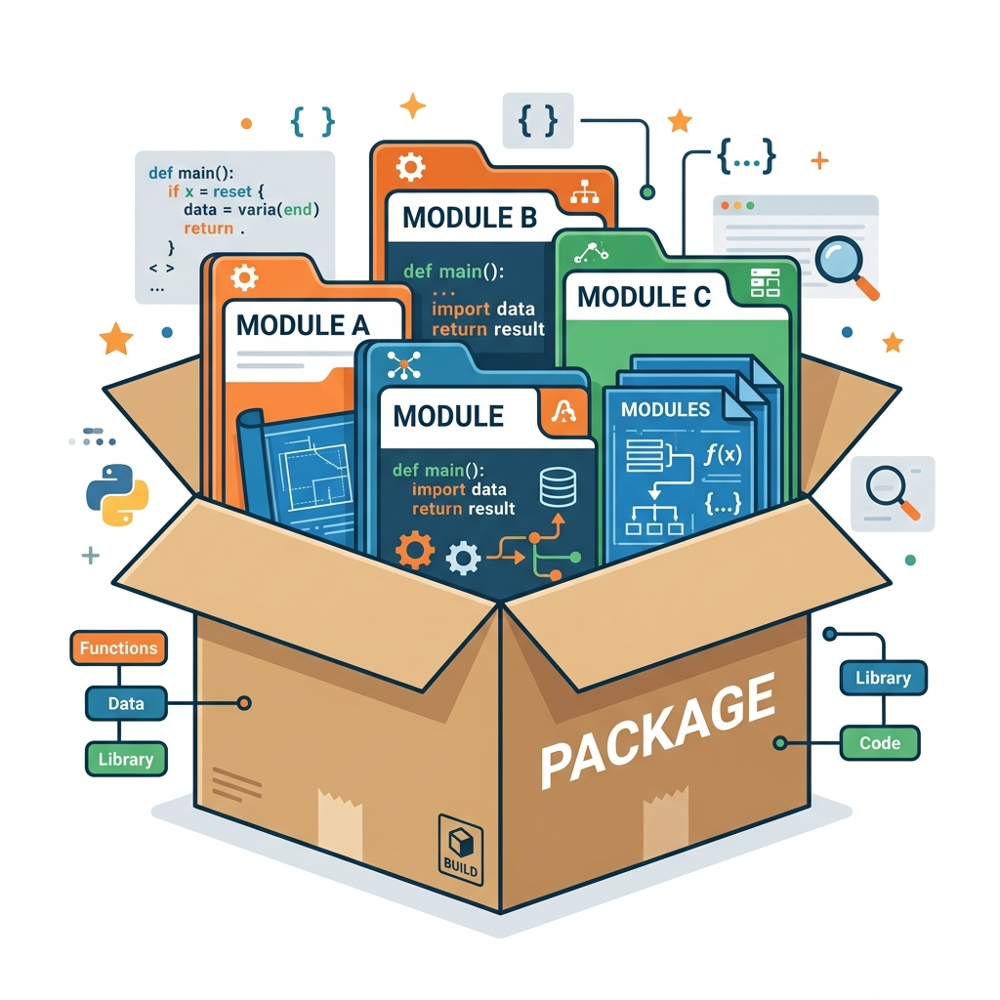

# Session 4: Functions, Modules, and Packages

## Objective & Real-World Application
As your programs grow larger, keeping all your code in one file becomes messy. Today, we will learn advanced function techniques and how to organize our code into **Modules** and **Packages**—just like how a mechanic organizes tools into drawers and toolboxes.

## 1. Advanced Functions

### Recursive Functions
A recursive function is a function that calls *itself* during its execution. It's often used to solve complex mathematical problems by breaking them down into smaller, similar problems.

*Rule of Thumb:* A recursive function must ALWAYS have a "base case" to stop it from calling itself forever (which would crash your program!).

```python
# Example: Calculating factorial (e.g., 5! = 5 * 4 * 3 * 2 * 1)
def factorial(n):
    if n == 1:  # Base Case: Stop calling itself
        return 1
    else:
        # The function calls itself!
        return n * factorial(n - 1)

print("Factorial of 5 is:", factorial(5))
```

### Lambda Functions (Anonymous Functions)
Sometimes you need a tiny, throwaway function for a short period. A lambda function is a small, one-line function that doesn't have a name.

```python
# Regular function
def add_ten(a):
    return a + 10

# The same function written as a Lambda function
add_ten_lambda = lambda a : a + 10

print(add_ten_lambda(5))  # Output: 15
```

## 2. Modules and Packages

Imagine you've written a brilliant function. If you want to use it in another project, you don't want to copy-paste the code. Instead, you put it in a module!



### What is a Module?
A **Module** is simply a Python file (`.py`) containing a set of functions and variables you want to include in your application.

**How to create and use a module:**
1. Create a file named `mymath.py`:
   ```python
   def add(x, y):
       return x + y
   ```
2. In your main file, you can **import** that module to use its functions:
   ```python
   import mymath
   
   result = mymath.add(5, 5)
   print(result)
   ```

### What is a Package?
If a Module is a file, a **Package** is a folder (directory) that contains multiple modules. It helps organize related modules together. 
*(Note: To make Python treat a folder as a package, it historically needed a special file named `__init__.py` inside it).*

**How to import from a package:**
```python
# Assuming a folder 'math_tools' containing a module 'geometry.py'
from math_tools import geometry

area = geometry.calculate_circle_area(5)
```

---

## 📺 Further Reading & Video Suggestions
To deepen your understanding of these concepts, check out:
- **"Python Recursion for Beginners"** by Computer Science
- **"Python Lambda Functions"** by Corey Schafer
- **"Python Tutorial: Modules and Packages"** by Programming with Mosh
