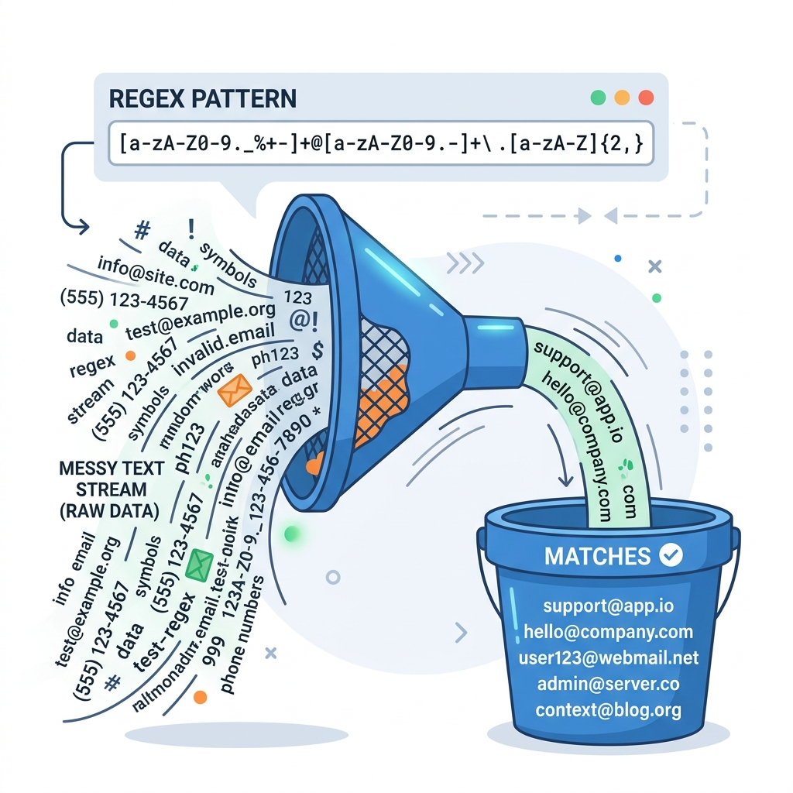
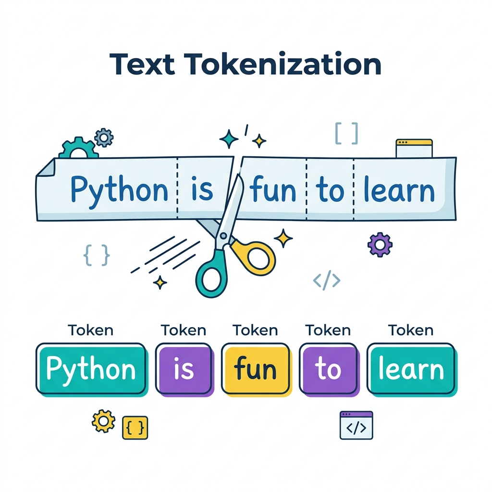

# Session 7: Regular Expressions and Tokenization of Text in Python

## Objective & Real-World Application
Have you ever wondered how Gmail instantly detects if an email address is valid? Or how a form knows your phone number is in the wrong format before you even click "Submit"? The answer is **Regular Expressions (Regex)** — one of the most powerful text-processing tools in programming.

**Real-World Examples:**
- **Form Validation:** Checking if a user's email is formatted correctly (`user@example.com`).
- **Search Engines:** Google uses regex-like patterns to match search queries to relevant pages.
- **Data Cleaning:** Stripping out special characters and noise from messy datasets before analysis.
- **Cybersecurity:** Scanning log files for suspicious patterns like repeated failed logins.
- **Natural Language Processing (NLP):** Splitting large bodies of text into words (tokens) before feeding them to a machine learning model.

---

## 1. What Are Regular Expressions?

A **Regular Expression (Regex)** is a special sequence of characters that defines a **search pattern**. Think of it like a very smart `Ctrl+F` (Find) that doesn't just look for exact words — it looks for *patterns*.



*A regex pattern acts like a funnel — you pour in a large body of messy text and only what matches your pattern comes out the other end.*

Python's built-in `re` module gives you all the tools you need to work with regular expressions. You must import it first:

```python
import re
```

---

## 2. Benefits of Regular Expressions

| Benefit | Example Use Case |
|---------|-----------------|
| **Speed** | Scan millions of lines of log data in seconds |
| **Flexibility** | Match broad patterns, not just exact strings |
| **Built-in to Python** | No extra library needed — just `import re` |
| **Universal** | Regex syntax is similar across Python, JavaScript, Java, etc. |
| **Data Validation** | Instantly verify email, phone, and ID formats |

---

## 3. Building Blocks: Characters, Classes, Sequences & Metacharacters

Regex patterns are built from special characters that each have a specific meaning. Let's break them down one group at a time.

### 3.1 Metacharacters (Special Symbols)
These characters have a special meaning in regex and do NOT match themselves literally.

| Metacharacter | Meaning | Example |
|---------------|---------|---------|
| `.` | Matches **any single character** (except newline) | `c.t` matches `cat`, `cut`, `cot` |
| `^` | Matches the **start** of a string | `^Hello` matches strings beginning with `Hello` |
| `$` | Matches the **end** of a string | `world$` matches strings ending with `world` |
| `*` | Matches **0 or more** of the preceding character | `ab*` matches `a`, `ab`, `abb`, `abbb` |
| `+` | Matches **1 or more** of the preceding character | `ab+` matches `ab`, `abb` but NOT `a` |
| `?` | Matches **0 or 1** of the preceding character (makes it optional) | `colou?r` matches both `color` and `colour` |
| `\` | **Escape** character — makes the next character literal | `\.` matches a literal dot `.` |
| `|` | **OR** — matches either the left or right pattern | `cat|dog` matches `cat` or `dog` |
| `()` | **Groups** a pattern together | `(ab)+` matches `ab`, `abab`, `ababab` |

### 3.2 Character Classes `[ ]`
Square brackets let you define a **set** of characters to match.

| Pattern | Meaning | Matches |
|---------|---------|---------|
| `[abc]` | Any one of `a`, `b`, or `c` | `a`, `b`, `c` |
| `[a-z]` | Any lowercase letter | `a` to `z` |
| `[A-Z]` | Any uppercase letter | `A` to `Z` |
| `[0-9]` | Any single digit | `0` to `9` |
| `[^abc]` | Any character **except** `a`, `b`, `c` | `d`, `e`, `1`, etc. |
| `[a-zA-Z0-9]` | Any letter or digit (alphanumeric) | `a`, `Z`, `5` |

### 3.3 Special Sequences (Shorthand Classes)
Python provides handy shorthand sequences for common character groups.

| Sequence | Meaning | Equivalent |
|----------|---------|------------|
| `\d` | Any **digit** | `[0-9]` |
| `\D` | Any **non-digit** | `[^0-9]` |
| `\w` | Any **word** character (letters, digits, underscore) | `[a-zA-Z0-9_]` |
| `\W` | Any **non-word** character | `[^a-zA-Z0-9_]` |
| `\s` | Any **whitespace** (space, tab, newline) | `[ \t\n\r]` |
| `\S` | Any **non-whitespace** character | `[^ \t\n\r]` |
| `\b` | A **word boundary** (start or end of a word) | |

### 3.4 Quantifiers (How Many Times?)
Quantifiers control how many times a character or group must appear.

| Quantifier | Meaning | Example |
|------------|---------|---------|
| `{n}` | Exactly `n` times | `\d{4}` matches exactly 4 digits |
| `{n,}` | At least `n` times | `\d{2,}` matches 2 or more digits |
| `{n,m}` | Between `n` and `m` times | `\d{2,4}` matches 2, 3, or 4 digits |

---

## 4. The `re` Module: Key Methods

### `re.search()` — Find the First Match Anywhere
Returns a **Match object** if the pattern is found anywhere in the string, or `None` if not.
```python
import re

text = "My phone number is 0801-234-5678"
match = re.search(r"\d{4}-\d{3}-\d{4}", text)

if match:
    print("Phone found:", match.group())  # Output: 0801-234-5678
else:
    print("No phone number found.")
```
> **Note:** The `r` before the string (raw string) tells Python to treat backslashes `\` literally and not as escape characters. Always use raw strings `r"..."` with regex!

### `re.match()` — Match Only at the Start
Only checks if the pattern matches at the **beginning** of the string.
```python
result = re.match(r"Hello", "Hello, World!")
if result:
    print("Match found!")  # Output: Match found!

result = re.match(r"World", "Hello, World!")
if result:
    print("Match found!")
else:
    print("No match — 'World' is not at the start.")
```

### `re.findall()` — Find ALL Matches
Returns a **list** of all non-overlapping matches. This is one of the most commonly used regex methods.
```python
text = "Contact us at info@school.com or support@aptech.com"
emails = re.findall(r"[\w.-]+@[\w.-]+\.\w+", text)
print(emails)  # Output: ['info@school.com', 'support@aptech.com']
```

### `re.sub()` — Find and Replace
Replaces all matches of a pattern with a new string. Extremely useful for data cleaning.
```python
text = "My phone is 0801-234-5678. Call me!"
# Remove all digits from the string
cleaned = re.sub(r"\d", "*", text)
print(cleaned)  # Output: My phone is ****-***-****. Call me!
```

### `re.split()` — Split a String by Pattern
Splits a string wherever the pattern matches — much more powerful than the regular `.split()` method.
```python
text = "apple; banana, cherry: date"
# Split on any of: semicolon, comma, or colon (optionally followed by a space)
fruits = re.split(r"[;,:\s]+", text)
print(fruits)  # Output: ['apple', 'banana', 'cherry', 'date']
```

---

## 5. Tokenization Using Regular Expressions

**Tokenization** is the process of breaking a body of text into smaller, meaningful units called **tokens**. These tokens are usually words, sentences, or other meaningful chunks. This is the very first step in almost all **Natural Language Processing (NLP)** and **Machine Learning** text analysis pipelines.



*Tokenization is like cutting a sentence into individual word blocks — allowing a computer to process text word by word instead of as one big unreadable chunk.*

### Why is Tokenization Important?
Before a machine learning model can "understand" text (like classifying spam emails or analyzing product reviews), the raw text must first be cleaned and broken into tokens. You can't process a whole essay at once — you process it word by word.

### Word Tokenization with `re.findall()`
The most common approach is to use `\w+` to find every sequence of word characters (letters, digits, underscore).

```python
import re

text = "Python is amazing! Let's learn it in 2024."

# Find all word-like tokens (ignores punctuation)
tokens = re.findall(r"\w+", text)
print(tokens)
# Output: ['Python', 'is', 'amazing', 'Let', 's', 'learn', 'it', 'in', '2024']
```

### Sentence Tokenization with `re.split()`
You can also split a paragraph into individual sentences.
```python
import re

paragraph = "Python is great. It is easy to learn! Are you ready to start?"

# Split on '.', '!' or '?' followed by a space
sentences = re.split(r"[.!?]\s*", paragraph)
# Remove any empty strings that may result from the split
sentences = [s for s in sentences if s]
print(sentences)
# Output: ['Python is great', 'It is easy to learn', 'Are you ready to start']
```

### Practical Example: Cleaning a Messy Dataset
Imagine you scraped some user reviews and they contain HTML tags, extra spaces, and special characters. Here's how you'd clean them before analysis:

```python
import re

raw_review = "  <b>Great product!!</b>  Price was N5,000. Would buy AGAIN!!!  "

# Step 1: Remove HTML tags
clean = re.sub(r"<[^>]+>", "", raw_review)

# Step 2: Remove non-alphabetic characters (keep only words and spaces)
clean = re.sub(r"[^a-zA-Z\s]", "", clean)

# Step 3: Remove extra whitespace
clean = re.sub(r"\s+", " ", clean).strip()

# Step 4: Tokenize
tokens = re.findall(r"\w+", clean.lower())

print(clean)   # Output: Great product  Price was  Would buy AGAIN
print(tokens)  # Output: ['great', 'product', 'price', 'was', 'would', 'buy', 'again']
```

---

## 📺 Further Reading & Video Suggestions
- **"Regular Expressions (Regex) Tutorial"** by Corey Schafer
- **"Python Regex Tutorial for Beginners"** by Tech With Tim
- **"Regular Expressions in Python - Full Course"** by freeCodeCamp
- **"Tokenization in NLP explained simply"** by StatQuest with Josh Starmer
