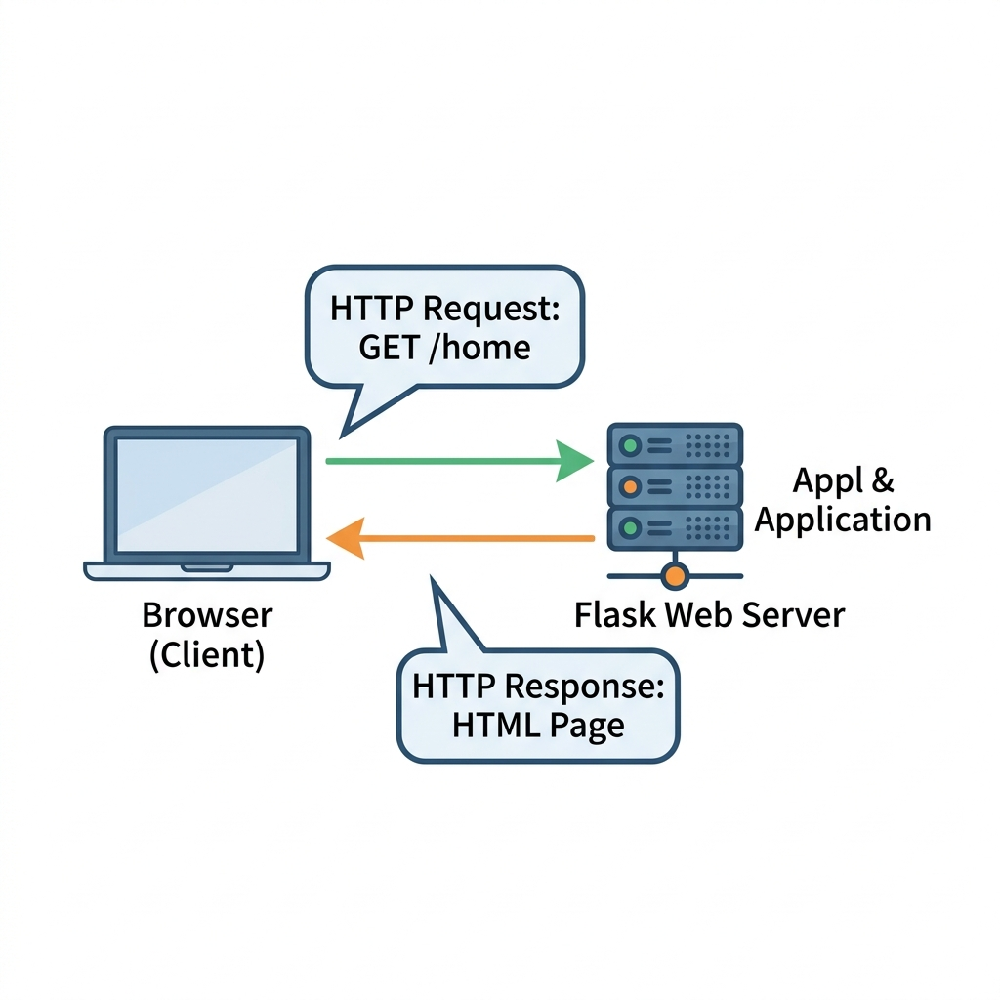
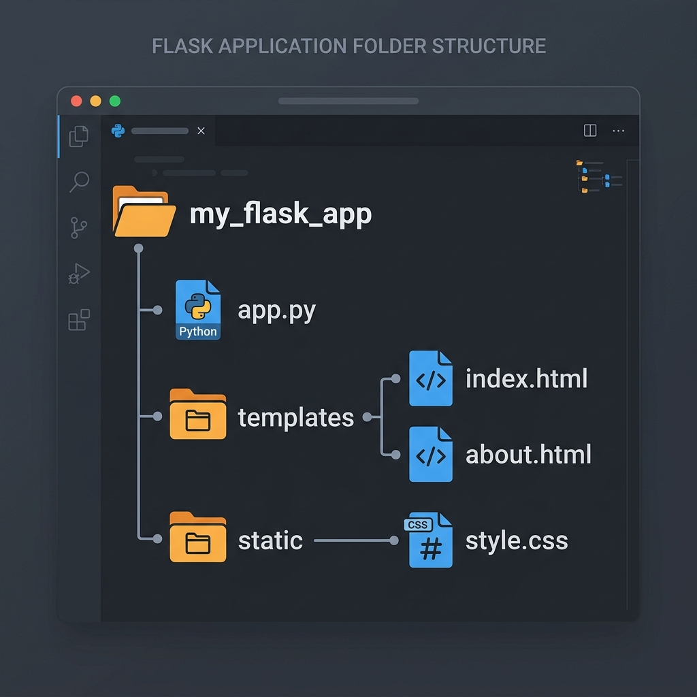

# Session 8: Web Development Using Flask

## Objective & Real-World Application
Everything you've learned so far — variables, functions, file handling, regex — has been running inside your computer's terminal. But the world runs on the **web**. In this session, you will build your very first web application using **Flask**, a lightweight Python web framework.

**Real-World Examples:**
- Instagram, Pinterest, and LinkedIn were all built using Python-based web frameworks.
- Flask is the go-to choice for building quick prototypes, REST APIs, and internal tools at companies like Netflix, Reddit, and Airbnb.
- After this session, you will understand exactly how websites serve content when you type a URL into a browser.

---

## 1. What is Flask?

**Flask** is a lightweight **micro web framework** for Python. "Micro" doesn't mean it's limited — it means Flask keeps the core simple and clean, letting you add only what you need, one piece at a time.

**Flask vs Django (Quick Comparison):**
| Feature | Flask | Django |
|---------|-------|--------|
| Size | Lightweight, minimal | Full-featured, "batteries included" |
| Best for | APIs, small apps, learning | Large, complex applications |
| Flexibility | Very high — you control everything | More opinionated — follows strict patterns |
| Learning Curve | Low — great for beginners | Steeper |

Think of Flask as a bicycle — fast, simple, and you're in full control. Django is more like a car — more features, but more to learn before driving.

### How the Web Works: Request & Response

Before writing any code, let's understand what happens when you open a website.



1. You type `http://127.0.0.1:5000/` in your browser.
2. Your browser sends an **HTTP Request** to the Flask web server.
3. Flask receives the request, runs the matching Python function (called a **route**).
4. Flask sends back an **HTTP Response** — usually an HTML page.
5. Your browser displays the HTML as a web page.

---

## 2. Flask Setup and Installation

### Step 1: Check Your Python Version
Open your terminal and confirm Python is installed (should be 3.6 or higher):
```bash
python --version
```

### Step 2: Create a Virtual Environment (Best Practice)
A virtual environment keeps your project's dependencies isolated from other Python projects on your machine — like a self-contained sandbox.

```bash
# Create a virtual environment named 'venv'
python -m venv venv

# Activate it on Windows
venv\Scripts\activate

# Activate it on Mac/Linux
source venv/bin/activate
```
> You'll know it's active when you see `(venv)` at the start of your terminal prompt.

### Step 3: Install Flask
With your virtual environment active, install Flask using `pip`:
```bash
pip install flask
```

### Step 4: Confirm Installation
```bash
python -c "import flask; print(flask.__version__)"
```
If a version number is printed (e.g., `3.0.3`), Flask is installed correctly! ✅

---

## 3. Building a Flask Application

### 3.1 Project Folder Structure
Good Flask projects follow a specific structure. This keeps your code organized as the app grows.



```
my_flask_app/
├── app.py              ← Main application file (the brain)
├── templates/          ← HTML files go here
│   ├── index.html
│   └── about.html
└── static/             ← CSS, images, JavaScript go here
    └── style.css
```

> **Why `templates`?** Flask automatically looks in a folder called `templates` for your HTML files. This name is not optional!

### 3.2 Your First Flask App

Create `app.py` in your project folder:

```python
# app.py — The heart of your Flask application
from flask import Flask

# 1. Create the Flask application instance
# __name__ tells Flask where to look for templates and static files
app = Flask(__name__)

# 2. Create a route — this maps a URL to a Python function
@app.route("/")          # The decorator defines the URL path
def home():              # This function runs when someone visits "/"
    return "<h1>Welcome to My First Flask App!</h1>"

# 3. Run the application
if __name__ == "__main__":
    app.run(debug=True)  # debug=True auto-reloads when you save changes
```

**Run it from your terminal:**
```bash
python app.py
```
Open your browser and go to `http://127.0.0.1:5000/` — you should see your heading! 🎉

---

### 3.3 Using HTML Templates with `render_template()`

Returning raw HTML strings from Python functions is messy for large pages. Flask's solution is **Jinja2 templating** — you write proper HTML files in the `templates/` folder and Flask fills in the dynamic data.

**Step 1:** Create `templates/index.html`:
```html
<!DOCTYPE html>
<html lang="en">
<head>
    <meta charset="UTF-8">
    <title>My Flask App</title>
</head>
<body>
    <h1>Hello, {{ name }}!</h1>
    <p>Welcome to the Flask web app.</p>
</body>
</html>
```
> **`{{ name }}`** is Jinja2 template syntax — Flask will replace this placeholder with a real Python value.

**Step 2:** Update `app.py` to use the template:
```python
from flask import Flask, render_template

app = Flask(__name__)

@app.route("/")
def home():
    # Pass data to the template using keyword arguments
    return render_template("index.html", name="Alice")

if __name__ == "__main__":
    app.run(debug=True)
```

---

### 3.4 Adding Multiple Routes

A real web app has multiple pages. Each page is its own route:

```python
from flask import Flask, render_template

app = Flask(__name__)

@app.route("/")
def home():
    return render_template("index.html", name="Student")

@app.route("/about")
def about():
    return render_template("about.html")

@app.route("/contact")
def contact():
    return "<h2>Contact us at info@school.com</h2>"

if __name__ == "__main__":
    app.run(debug=True)
```
Now visiting `http://127.0.0.1:5000/about` will load the about page!

---

### 3.5 Handling Form Data with POST Requests

Real web apps collect input from users via HTML forms. Flask handles this using HTTP **POST** requests.

**Step 1:** Create `templates/login.html`:
```html
<!DOCTYPE html>
<html>
<body>
    <h2>Login</h2>
    <form method="POST" action="/login">
        <label>Username:</label>
        <input type="text" name="username"><br><br>
        <input type="submit" value="Login">
    </form>
</body>
</html>
```

**Step 2:** Handle the form in `app.py`:
```python
from flask import Flask, render_template, request

app = Flask(__name__)

# This route handles both loading the page (GET) and submitting the form (POST)
@app.route("/login", methods=["GET", "POST"])
def login():
    if request.method == "POST":
        username = request.form["username"]
        return f"<h2>Welcome, {username}!</h2>"
    return render_template("login.html")

if __name__ == "__main__":
    app.run(debug=True)
```

---

## 📺 Further Reading & Video Suggestions
- **"Python Flask Tutorial: Full-Featured Web App"** by Corey Schafer *(Highly recommended — a 10-part series!)*
- **"Flask Tutorial for Beginners"** by Tech With Tim
- **"Build a Web App with Python and Flask"** by freeCodeCamp
- **"Flask in 100 Seconds"** by Fireship *(Great quick overview!)*
