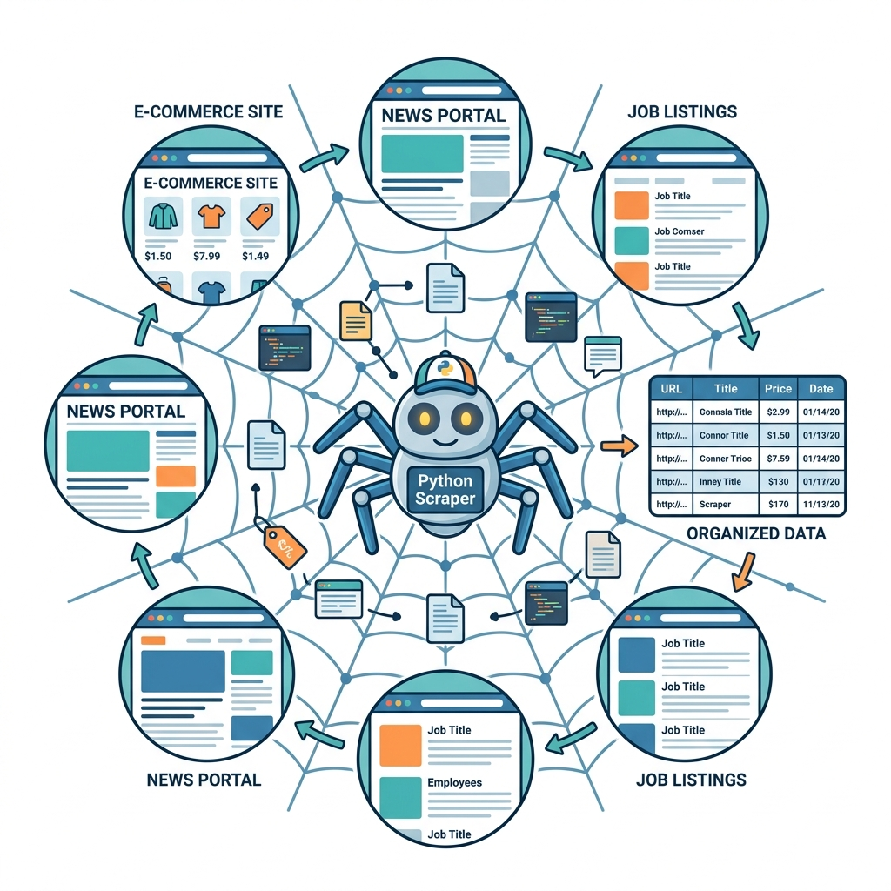
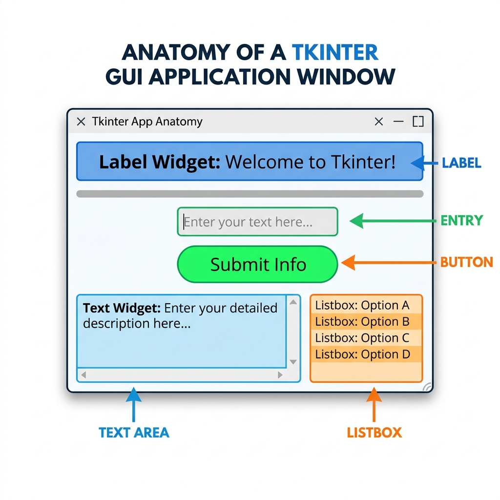

# Session 9: Web Scraping & GUI Programming in Tkinter

This is a double session covering two powerful and completely different Python skills: **Web Scraping** — automatically extracting data from websites — and **GUI Programming with Tkinter** — building real desktop applications with buttons, text boxes, and windows.

---

# PART A: Web Scraping in Python (Session 8)

## Objective & Real-World Application
Imagine you need the latest prices of 500 products from an e-commerce site, or a list of every news headline published today. Would you copy-paste each one manually? Absolutely not! **Web scraping** is the automated process of collecting data from websites using code.

**Real-World Examples:**
- **Job Sites:** LinkedIn scrapers collect thousands of job listings for analytics dashboards.
- **Price Monitoring:** Companies like PriceRunner scrape Amazon and eBay hourly to track price changes.
- **Research:** Academics scrape social media platforms for sentiment analysis research.
- **News Aggregators:** Apps like Flipboard scrape headlines from hundreds of news sources.

---

## 1. What is Web Scraping?



**Web Scraping** is the automated extraction of data from websites. Your Python script acts like a browser — it fetches the HTML source code of a page, then parses that HTML to find and extract the specific data you need.

The overall process works in three steps:
1. **Fetch:** Send an HTTP request to get the webpage's HTML (like `requests`).
2. **Parse:** Read through the HTML and find the data you need (like `BeautifulSoup`).
3. **Store:** Save the extracted data to a file, database, or use it in your program.

---

## 2. Rules of Web Scraping (Ethics & Legality)

Web scraping is powerful, but it must be done responsibly. Breaking these rules can get your IP address banned, or worse, lead to legal consequences.

| Rule | Why It Matters |
|------|---------------|
| ✅ **Check `robots.txt`** | Every website has a `robots.txt` file (e.g., `https://example.com/robots.txt`) that lists which pages scrapers are allowed to visit. Always respect it. |
| ✅ **Don't overload servers** | Add `time.sleep()` between requests. Sending thousands of requests per second is like a DDoS attack. |
| ✅ **Scrape public data only** | Never scrape data behind a login wall without permission. |
| ✅ **Check the Terms of Service** | Some sites explicitly ban scraping in their ToS. |
| ✅ **Give credit** | If you publish scraped data, acknowledge the source. |
| ❌ **Don't scrape personal/private data** | This is a GDPR/privacy violation in many countries. |

---

## 3. Web Scraping Libraries in Python

Python has two essential libraries for web scraping:

### `requests` — Fetching Web Pages
The `requests` library sends HTTP requests to websites and returns the raw HTML response. It's like the delivery driver that picks up the package (HTML page) for you.

```bash
pip install requests
```

```python
import requests

# Send a GET request — like typing a URL into your browser
response = requests.get("https://books.toscrape.com/")

# Check the status code — 200 means success!
print(response.status_code)   # Output: 200

# Access the raw HTML of the page
print(response.text[:500])    # Print first 500 characters of HTML
```

### `BeautifulSoup` — Parsing HTML
Once you have the raw HTML, `BeautifulSoup` helps you navigate it and find the specific elements you need — like a GPS for HTML documents.

```bash
pip install beautifulsoup4
```

```python
from bs4 import BeautifulSoup

html = "<h1>Hello World</h1><p class='intro'>Welcome to Python!</p>"

# Parse the HTML string
soup = BeautifulSoup(html, "html.parser")

# Find the first <h1> tag
heading = soup.find("h1")
print(heading.text)  # Output: Hello World

# Find by class name
paragraph = soup.find("p", class_="intro")
print(paragraph.text)  # Output: Welcome to Python!
```

---

## 4. Implementing Web Scraping: Step by Step

Let's scrape real data from `https://books.toscrape.com/` — a website specifically designed for scraping practice.

### Understanding HTML Before Scraping
Before writing your scraper, open the target website in Chrome, right-click on the data you want, and select **"Inspect"**. This shows you the HTML structure — the element names and class names you'll target.

For `books.toscrape.com`, each book's title is in an `<h3>` tag and the price is in a `<p class="price_color">` tag.

### Full Working Scraper

```python
import requests
from bs4 import BeautifulSoup

# Step 1: Fetch the webpage
url = "https://books.toscrape.com/"
response = requests.get(url)

# Step 2: Parse the HTML
soup = BeautifulSoup(response.text, "html.parser")

# Step 3: Find all book articles on the page
books = soup.find_all("article", class_="product_pod")

print(f"Found {len(books)} books on this page.\n")

# Step 4: Loop through each book and extract data
for book in books:
    # Extract book title from the <h3> tag's <a> attribute
    title = book.h3.a["title"]

    # Extract price text from the price_color paragraph
    price = book.find("p", class_="price_color").text

    # Extract availability
    availability = book.find("p", class_="instock").text.strip()

    print(f"Title: {title}")
    print(f"Price: {price}")
    print(f"Available: {availability}")
    print("-" * 40)
```

### Saving Scraped Data to a File
```python
import requests
from bs4 import BeautifulSoup

url = "https://books.toscrape.com/"
response = requests.get(url)
soup = BeautifulSoup(response.text, "html.parser")
books = soup.find_all("article", class_="product_pod")

# Save results to a CSV-like text file
with open("books_data.txt", "w") as f:
    f.write("Title | Price | Availability\n")
    f.write("=" * 60 + "\n")
    for book in books:
        title = book.h3.a["title"]
        price = book.find("p", class_="price_color").text
        availability = book.find("p", class_="instock").text.strip()
        f.write(f"{title} | {price} | {availability}\n")

print("Data saved to books_data.txt!")
```

---

## 📺 Further Reading (Web Scraping)
- **"Python Web Scraping Tutorial – Full Course for Beginners"** by freeCodeCamp
- **"Web Scraping with Python - Beautiful Soup Crash Course"** by Tech With Tim
- **"Python Requests Tutorial"** by Corey Schafer

---
---

# PART B: GUI Programming in Tkinter (Session 9)

## Objective & Real-World Application
So far, every program we've built runs in a terminal. But most software the world uses has a **Graphical User Interface (GUI)** — windows, buttons, text fields, and menus. **Tkinter** is Python's built-in library for building desktop GUIs. No installation needed!

**Real-World Examples:**
- Python's own IDLE editor is built with Tkinter.
- Many internal business tools (inventory managers, form apps) are built with Tkinter.
- It's the fastest way to put a user-friendly window around your Python logic.

---

## 1. What is Tkinter?

**Tkinter** (pronounced "Tee-Kay-Inter") is Python's **standard GUI library** — it comes pre-installed with Python, so there's nothing to install. It provides the building blocks (called **widgets**) to create windows, buttons, labels, text boxes, and much more.

```python
import tkinter as tk  # 'tk' is the standard alias

# Create the main application window
window = tk.Tk()
window.title("My First GUI App")
window.geometry("400x300")  # Width x Height in pixels

# Start the event loop — keeps the window open and responsive
window.mainloop()
```
Running this creates a blank window! Every Tkinter app follows this same pattern: **create window → add widgets → start mainloop**.

---

## 2. Widgets and Their Properties

A **widget** is any visual element in a GUI — a button is a widget, a text label is a widget, an input field is a widget. Tkinter comes with many built-in widgets.



### Core Widgets Reference

| Widget | Purpose | Code |
|--------|---------|------|
| `Label` | Display non-editable text or images | `tk.Label(window, text="Hello")` |
| `Button` | Clickable button that triggers a function | `tk.Button(window, text="Click Me", command=my_func)` |
| `Entry` | Single-line text input field | `tk.Entry(window)` |
| `Text` | Multi-line text input area | `tk.Text(window, height=5, width=40)` |
| `Frame` | Invisible container to group widgets | `tk.Frame(window)` |
| `Listbox` | Scrollable list of selectable items | `tk.Listbox(window)` |
| `Checkbutton` | A checkbox (on/off) | `tk.Checkbutton(window, text="Agree")` |
| `Radiobutton` | Select one from a group of options | `tk.Radiobutton(window, text="Yes")` |
| `Scale` | A slider to select a numeric range | `tk.Scale(window, from_=0, to=100)` |
| `Scrollbar` | Adds scrolling to Text or Listbox widgets | `tk.Scrollbar(window)` |
| `Menu` | Creates a menu bar | `tk.Menu(window)` |

### Common Widget Properties (Options)

Every widget accepts **options** as keyword arguments that control its appearance:

| Option | Description | Example |
|--------|-------------|---------|
| `text` | The label text shown | `text="Submit"` |
| `font` | Font family, size, style | `font=("Arial", 14, "bold")` |
| `fg` | Foreground (text) color | `fg="white"` |
| `bg` | Background color | `bg="#2c3e50"` |
| `width` | Width of the widget | `width=20` |
| `height` | Height (for Text, Listbox) | `height=5` |
| `padx` / `pady` | Internal horizontal/vertical padding | `padx=10, pady=5` |
| `relief` | Border style (`flat`, `raised`, `sunken`, `groove`, `ridge`) | `relief="raised"` |
| `cursor` | Mouse cursor when hovering | `cursor="hand2"` |

---

## 3. Ways to Create and Place Widgets

Creating a widget is only half the job — you also need to tell Tkinter **where** to place it on the window. Tkinter provides three geometry managers:

### Method 1: `pack()` — Simple Stacking
Widgets are stacked one after another. Simplest to use.
```python
import tkinter as tk

window = tk.Tk()
window.title("Pack Example")

label = tk.Label(window, text="Hello, Tkinter!", font=("Arial", 16))
label.pack(pady=10)  # pady adds vertical space around it

button = tk.Button(window, text="Click Me!", bg="blue", fg="white")
button.pack(pady=5)

window.mainloop()
```

### Method 2: `grid()` — Row/Column Layout
Places widgets in a table-like grid of rows and columns. Best for forms.
```python
import tkinter as tk

window = tk.Tk()
window.title("Grid Example")

# Row 0
tk.Label(window, text="Name:").grid(row=0, column=0, padx=10, pady=5, sticky="e")
tk.Entry(window).grid(row=0, column=1, padx=10, pady=5)

# Row 1
tk.Label(window, text="Email:").grid(row=1, column=0, padx=10, pady=5, sticky="e")
tk.Entry(window).grid(row=1, column=1, padx=10, pady=5)

# Row 2 - spanning both columns
tk.Button(window, text="Submit").grid(row=2, column=0, columnspan=2, pady=10)

window.mainloop()
```

### Method 3: `place()` — Absolute Positioning
Places widgets at exact pixel coordinates (`x`, `y`). Use sparingly — not responsive.
```python
label = tk.Label(window, text="I'm at position (50, 100)")
label.place(x=50, y=100)
```

---

## 4. Building Simple Applications with Widgets

### Example 1: A Simple Calculator (Addition)
```python
import tkinter as tk

def add_numbers():
    try:
        num1 = float(entry1.get())
        num2 = float(entry2.get())
        result = num1 + num2
        result_label.config(text=f"Result: {result}")
    except ValueError:
        result_label.config(text="Please enter valid numbers!", fg="red")

# Create the window
window = tk.Tk()
window.title("Simple Calculator")
window.geometry("300x200")

# Widgets
tk.Label(window, text="Number 1:").grid(row=0, column=0, padx=10, pady=10, sticky="e")
entry1 = tk.Entry(window)
entry1.grid(row=0, column=1, padx=10, pady=10)

tk.Label(window, text="Number 2:").grid(row=1, column=0, padx=10, pady=10, sticky="e")
entry2 = tk.Entry(window)
entry2.grid(row=1, column=1, padx=10, pady=10)

tk.Button(window, text="Add", command=add_numbers, bg="#27ae60", fg="white").grid(
    row=2, column=0, columnspan=2, pady=10
)

result_label = tk.Label(window, text="Result: ", font=("Arial", 12, "bold"))
result_label.grid(row=3, column=0, columnspan=2)

window.mainloop()
```

### Example 2: To-Do List App
```python
import tkinter as tk

def add_task():
    task = entry.get()
    if task:
        listbox.insert(tk.END, task)
        entry.delete(0, tk.END)  # Clear the entry field

def delete_task():
    selected = listbox.curselection()
    if selected:
        listbox.delete(selected)

window = tk.Tk()
window.title("To-Do List")
window.geometry("350x400")

tk.Label(window, text="My To-Do List", font=("Arial", 16, "bold")).pack(pady=10)

entry = tk.Entry(window, width=30, font=("Arial", 12))
entry.pack(pady=5)

tk.Button(window, text="Add Task", command=add_task, bg="#3498db", fg="white").pack(pady=5)

listbox = tk.Listbox(window, width=40, height=12, font=("Arial", 11))
listbox.pack(pady=10)

tk.Button(window, text="Delete Selected", command=delete_task, bg="#e74c3c", fg="white").pack()

window.mainloop()
```

---

## 📺 Further Reading (Tkinter)
- **"Python GUI with Tkinter - Full Course"** by freeCodeCamp
- **"Tkinter Course - Create Graphic User Interfaces with Python Tutorial"** by Tech With Tim
- **"Python Tkinter Tutorial"** by Corey Schafer
